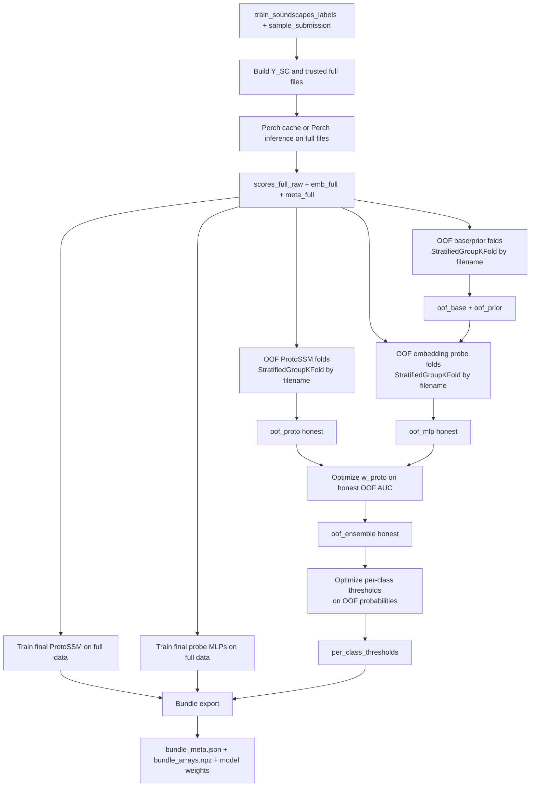

# Model Contributions to Final Prediction

This document explains, in depth, how each model and each processing stage contributes to the final prediction in the BirdCLEF ported pipeline.

It covers:
- The score flow from raw Perch outputs to final submission probabilities.
- Where each model contributes.
- Which parts are learned on honest OOF versus full-data retraining.
- How weights and thresholds are chosen.

## 1) High-Level Composition

At inference time, the main pre-sigmoid score is:

score_final = w_proto * score_proto + (1 - w_proto) * score_mlp + w_res * delta_res

Then probabilities are obtained using class temperature scaling:

prob_raw = sigmoid(score_final / T_class)

Then optional post-processing may modify probabilities, followed by per-class threshold shaping for submission output.

Main inference composition is in:
- birdclef_example/predict_ported_old_infer.py

Relevant sections:
- Proto branch output and reshape.
- Prior-fused baseline + probe branch.
- Proto/MLP weighted blend.
- Optional residual correction.
- Temperature scaling and sigmoid.
- Optional smoothing/scaling transforms.
- Per-class threshold shaping.

## 2) Component-by-Component Contribution

## 2.1 Perch Raw Output (Foundation)

Perch provides:
- Raw class logits per 5-second window.
- Embedding vectors per 5-second window.

This is the upstream signal for all downstream branches.

Contribution type:
- Direct: enters ProtoSSM via perch_logits in fusion.
- Direct: enters prior-fusion baseline branch.
- Indirect: embeddings feed probe features and Proto temporal modeling.

## 2.2 Prior-Fused Baseline Branch

The baseline branch takes raw scores and injects metadata priors from training labels:
- Global class prevalence.
- Site-conditioned prevalence.
- Hour-conditioned prevalence.
- Site-hour conditioned prevalence.

Those priors are estimated as probabilities, converted to logits, then mixed with score channels using class-group-specific lambdas.

Core functions in train file:
- fit_prior_tables
- prior_logits_from_tables
- fuse_scores_with_tables

Effect on final prediction:
- This branch is the default score for all classes.
- Even when probe models exist, probe output is blended with this baseline (not replacing it completely).

## 2.3 Probe (MLP) Branch

For eligible classes (enough positives), a class-specific MLP probe is trained using features built from:
- PCA-projected embeddings.
- Raw score.
- Prior logit.
- Baseline fused score.
- Temporal context features (prev, next, file mean, file max, std, interactions).

At inference, for each class with a trained probe:

score_mlp_c = (1 - alpha_probe) * base_c + alpha_probe * probe_c

For classes without probe models:

score_mlp_c = base_c

So the MLP branch is effectively:
- A selective refinement layer on top of baseline.
- Conservative where class data is sparse.

## 2.4 ProtoSSM Branch

ProtoSSM consumes window sequences (12 windows per file) and metadata embeddings (site/hour). It learns temporal patterns and class prototypes.

Inside ProtoSSM, species logits are fused per class as:

score_proto_c = alpha_c * sim_c + (1 - alpha_c) * perch_logit_c

Where:
- sim_c is prototype similarity logit.
- alpha_c is learned per-class fusion weight (sigmoid parameterized).

This means ProtoSSM is itself already an internal ensemble between:
- Prototype temporal representation.
- Original Perch logits.

## 2.5 Top-Level Proto vs MLP Ensemble

After obtaining score_proto and score_mlp, they are blended globally:

score_blend = w_proto * score_proto + (1 - w_proto) * score_mlp

w_proto is selected by grid search on honest OOF predictions only.

Interpretation:
- If ProtoSSM adds stronger generalization, w_proto moves higher.
- If probe/base is stronger or more stable, w_proto moves lower.

## 2.6 ResidualSSM Correction (Optional)

If enabled and weights exist, ResidualSSM predicts a correction term delta_res from:
- Embeddings.
- First-pass blended scores.
- Metadata.

Then:

score_final = score_blend + w_res * delta_res

This is an additive second-stage calibration/correction model.

Important distinction:
- Residual training in this script is not OOF across full data; it uses an internal train/val split on residual targets.
- So this stage can improve fit but should be interpreted carefully relative to strict OOF estimates.

## 3) Probability and Submission Stages

## 3.1 Temperature Scaling

Before sigmoid, class logits are divided by class temperature:
- One default for aves.
- Another for texture taxa (for example amphibians/insects).

Lower temperature sharpens probabilities; higher temperature softens them.

## 3.2 Optional Probability Post-Processing

The script can optionally apply:
- file_level_top_k confidence scaling
- rank-aware scaling
- adaptive delta smoothing

These are probability-space transforms and can change ranking and calibration.

## 3.3 Per-Class Threshold Shaping

Final submission output applies per-class threshold shaping function.
This is not hard binarization; it rescales values around each class threshold so that 0.5 aligns with class threshold.

Thresholds are learned from OOF probabilities in train script.

## 4) Where Weights Come From (Training-Time)

## 4.1 Honest OOF Foundations

The script computes multiple honest OOF artifacts:
- OOF prior-fused baseline.
- OOF probe outputs.
- OOF ProtoSSM outputs.

These are produced with grouped folds by filename, so a file never appears in both train and validation within a fold.

## 4.2 Metric Used for Model Selection

Primary selection metric is macro ROC-AUC over non-empty classes:
- macro_auc_skip_empty

Used for:
- Baseline OOF quality.
- Probe OOF quality.
- ProtoSSM OOF quality.
- Ensemble weight search over Proto/MLP blend.

## 4.3 Threshold Objective is Different

Per-class thresholds are optimized using F1-like objective per class on OOF probabilities.
So:
- AUC chooses model blend quality.
- Threshold optimization chooses decision calibration around class-specific PR tradeoffs.

## 5) Practical Interpretation of Contribution Strength

Contribution strength is governed by these parameters:
- alpha_probe: how much probe overrides baseline on modeled classes.
- alpha_c inside ProtoSSM: classwise prototype vs perch mix.
- w_proto: global Proto vs MLP branch mix.
- w_res: additive residual correction strength.
- T_class: probability sharpness per class group.
- Thresholds: final output shaping around class operating points.

In short:
- Baseline + priors gives robust metadata-aware prior structure.
- Probes add classwise discriminative refinement.
- ProtoSSM adds sequence-level temporal/context representation.
- ResidualSSM optionally patches remaining systematic errors.
- Temperature + thresholds map logits into submission-operating behavior.

## 6) Why OOF Matters for Contribution Trust

Without OOF, contribution weights can look better than they are due to in-sample bias.
This script intentionally uses honest OOF for key selection steps (especially w_proto and thresholds source predictions), which makes contribution estimates more reliable.

When comparing with infer-time evaluation on train soundscapes:
- Infer can be higher because final models are retrained on full data.
- OOF remains the main anti-leakage estimate for tuning decisions.

## 7) Minimal Mental Model

Think of final prediction as three nested ensembles:

1) Inside baseline branch:
- Perch logits + metadata priors.

2) Inside Proto branch:
- Prototype similarity + Perch logits.

3) Top-level branch fusion:
- Proto branch + Probe-refined baseline branch + optional residual correction.

Then calibration/output layers:
- temperature -> sigmoid -> optional transforms -> per-class threshold shaping.

That full stack is what produces final submission probabilities per class per row.

## 8) Visual Diagrams

## 8.1 Inference-Time Contribution Flow

```mermaid
flowchart TD
	A[Audio 60s file] --> B[Perch inference]
	B --> B1[Raw logits per 5s window]
	B --> B2[Embeddings per 5s window]

	B1 --> C[Prior fusion using site/hour/site-hour tables]
	C --> C1[Base fused scores]

	B2 --> D[Embedding scaler + PCA]
	D --> E[Class-wise probe MLPs]
	C1 --> E
	B1 --> E
	E --> E1[MLP branch scores]

	B2 --> F[ProtoSSM sequence model]
	B1 --> F
	F --> F1[Proto branch scores]

	F1 --> G[Top-level blend]
	E1 --> G
	G --> G1[score_blend = w_proto*proto + (1-w_proto)*mlp]

	G1 --> H{ResidualSSM available?}
	H -- yes --> H1[Residual correction delta_res]
	H1 --> H2[score_final = score_blend + w_res*delta_res]
	H -- no --> H2

	H2 --> I[Class temperature scaling]
	I --> J[sigmoid]
	J --> K[Raw probabilities]
	K --> L[Optional post-processing]
	L --> M[Per-class threshold shaping]
	M --> N[submission.csv]
```

## 8.2 Training and OOF Estimation Flow


